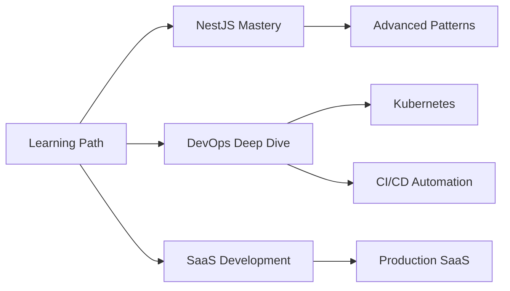

<div align="center">

# ✨ AVI RAJ

### Backend Engineer | DevOps Enthusiast | Freelance Developer


</div>

---

## 🎯 What I Do

I specialize in building **robust backend systems** and **scalable architectures** for startups, enterprises, and individual clients. Whether you need a complete SaaS platform, API development, or DevOps consulting, I bring ideas to life with clean, maintainable code.

```javascript
const aviRaj = {
    title: "Backend Engineer & Freelance Developer",
    location: "India 🇮🇳",
    specialization: ["Backend Development", "API Design", "DevOps", "System Architecture"],
    currentlyLearning: ["NestJS", "Advanced DevOps", "CI/CD Pipelines", "Kubernetes"],
    availableFor: "Freelance Projects & Collaboration",
    email: "aviraj0403@gmail.com"
};
```

---

## 💼 Services I Offer

<table>
<tr>
<td width="50%">

### 🏗️ Backend Development
- RESTful & GraphQL API Design
- Microservices Architecture
- Database Design & Optimization
- Authentication & Authorization
- Real-time Systems (WebSockets)

</td>
<td width="50%">

### ☁️ DevOps & Cloud
- Docker Containerization
- CI/CD Pipeline Setup
- AWS Deployment & Management
- Nginx Configuration
- Server Optimization

</td>
</tr>
</table>

---

## 🚀 Tech Arsenal

<div align="center">

### Languages & Frameworks


### Databases & Tools


### DevOps & Cloud


</div>

---

## 📈 GitHub Performance

<div align="center">
  


</div>

---

## 🏆 Achievements & Recognition

<div align="center">


</div>

---

## 🎓 Current Focus



**Projects in Progress:**
- 🔨 Building a comprehensive SaaS platform with NestJS
- 🚀 Implementing advanced CI/CD pipelines
- 📦 Creating Docker-based microservices architecture
- ☁️ Deploying scalable applications on AWS

---

## 💬 Let's Connect

<div align="center">

**Available for Freelance Projects | Open Source Collaboration | Consulting**

[](mailto:aviraj0403@gmail.com)
[](https://www.linkedin.com/in/avi-raj-98b820226/)
[](https://instagram.com/aviraj0403)

</div>

---

## 💡 Why Work With Me?

<table>
<tr>
<td width="33%" align="center">

### ⚡ Fast Delivery
Clean, efficient code delivered on time

</td>
<td width="33%" align="center">

### 🎯 Quality First
Production-ready solutions with best practices

</td>
<td width="33%" align="center">

### 🤝 Great Communication
Regular updates and transparent workflow

</td>
</tr>
</table>

---

<div align="center">

### 💭 Developer Wisdom


---

### 📊 Contribution Graph


---

**⭐ If you find my work valuable, consider starring my repositories!**

*"Building the backend systems that power tomorrow's innovations"*

</div>
